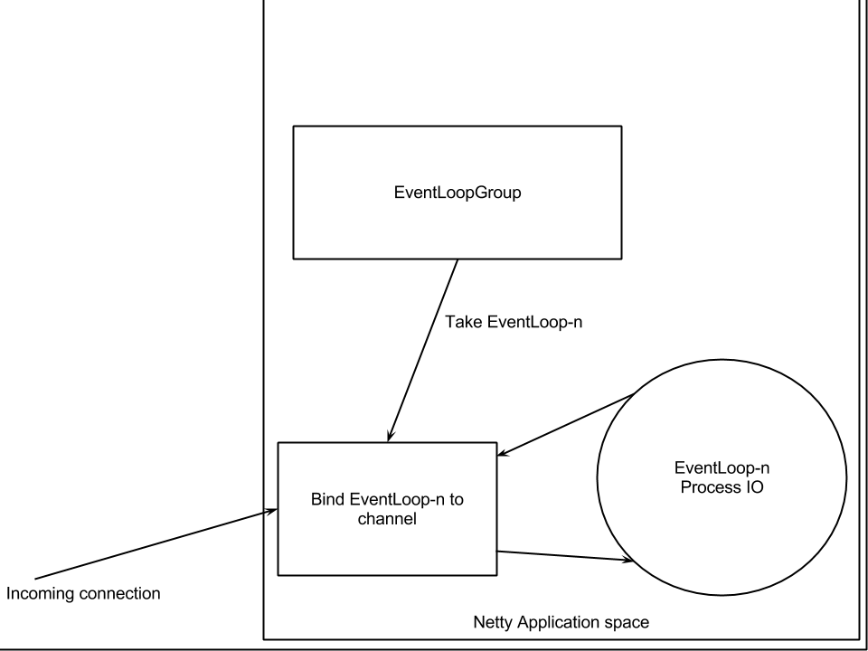
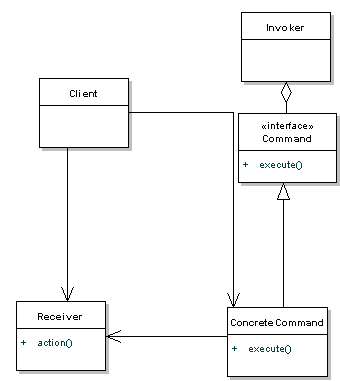

# Asynchronous Message Based Framework

----

## Netty

Netty is a framework for building non-blocking networking applications, it is mostly based on Java's NIO libraries.

### Futures
Futures are an abstraction of concurrent execution. Typically to execute tasks concurrently threads need to be created and started by hand; futures abstract this process by scheduling to execute the task whenever the processor is free to compute.

#### Long Running Future Operation

```java
import java.util.concurrent.Callable;
import java.util.concurrent.ExecutorService;
import java.util.concurrent.Executors;
import java.util.concurrent.Future;
import java.util.stream.LongStream;

public class Futures {
    public static long operation(long x) {
        return LongStream.range(2,x).map(i -> i*i).reduce(
          (i,j) -> i+j).getAsLong();
    }

    public static void main(String[] args) {
        long x = 100000000000L;

        ExecutorService executor = Executors.newCachedThreadPool();
        Runnable task = new Runnable() {
            public void run() {
                operation(x);
            }
        };

        Callable<Long> callable = new Callable<Long>(){
            @Override
            public Long call() {
                return operation(x);
            }
        };

        Future<?> executorFuture = executor.submit(task);
        Future<?> executorCallable = executor.submit(callable);

        System.out.println("Not Done");

        while(!executorFuture.isDone() || !executorCallable.isDone()){

        }

        System.out.println("Done");

        executor.shutdown();
    }

}
```

From the code above there are two ways to specify future operations:
- Runnables
- Callables

Runnables do not return results while Callables do. An executor service needs to be defined to schedule the threads for the execution of the tasks.

#### CallBacks
CallBacks are a method for abstracting asynchronous operations as they all for method nesting. To implement callbacks neatly interfaces need to be created for specifying the sequence of callbacks.

```java
public interface CallBack {
    void fetchData(CallBackResult result);
}
```

Another interface will be created to handle the results of the callback.

```java
public interface CallBackResult {
    void onData(Long data);
    void onError(Throwable cause);
}
```

Implementation of both interfaces

```java
import java.util.concurrent.ExecutorService;
import java.util.concurrent.Executors;
import java.util.stream.LongStream;

public class CallBacks {
    public static long operation(long x) throws Exception {
        if (x < 2) {
            throw new Exception("Negative Range Not Allowed");
        } else {
            return LongStream.range(2, x).map(i -> i * i).reduce(
              (i, j) -> i + j).getAsLong();
        }
    }

    public static void main(String[] args) {

        long x = 100000000000L;
//        long x = 10000L;
        CallBack fetcher = new CallBack() {
            @Override
            public void fetchData(CallBackResult result) {
                try {
                    result.onData(operation(x));
                } catch (Exception e) {
                    result.onError(e);
                }
            }
        };

        fetcher.fetchData(new CallBackResult() {
            @Override
            public void onData(Long data) {
                System.out.println("Computation complete, Result: " + data);
            }

            @Override
            public void onError(Throwable cause) {
                cause.printStackTrace();
            }
        });
    }
}
```
The problem with callbacks is that they can produce spaghetti code rather quickly and yet remain locked to one thread. It is possible to implement each callback to run in a separate thread however, Java 8 abstracts this tedious task of handling threads manually.

#### Java 8 Completable Futures
*Completable Futures* are a new addition to the Java concurrent package, they abstract the creation of asynchronous tasks. A Completable Future consists of multiple *Completion Stages*, these can be thought of as pipelined callbacks.

```java
import java.util.concurrent.CompletableFuture;
import java.util.function.Consumer;
import java.util.function.Supplier;
import java.util.stream.LongStream;

public class AsyncCallBack {
    public static long operation(long x) throws Exception {
        if (x < 2) {
            throw new Exception("Negative Range Not Allowed");
        } else {
            return LongStream.range(2, x).map(i -> i * i).reduce(
            (i, j) -> i + j).getAsLong();
        }
    }

    @SuppressWarnings("unchecked")
    public static void main(String[] args) {
        long x = 100000000000L;
//        long x = 1;

        Supplier s = new Supplier() {
            @Override
            public Object get() {
                long result = 0;
                try {
                    result = operation(x);
                } catch (Exception e) {
                    e.printStackTrace();
                }
                return result;
            }
        };

        Consumer c = new Consumer() {
            @Override
            public void accept(Object o) {
                System.out.println("Result: " + o);
            }
        };

        try {
          CompletableFuture cf = CompletableFuture.supplyAsync(s)
                    .whenCompleteAsync((r, e) -> {
                        if (r.getClass() == Long.class) {
                            c.accept(r);
                        } else {
                            System.out.println(r.getClass().toString());
                            ((Exception) r).printStackTrace();
                        }
                    });
          long i =0;
          while (!cf.isDone()){
            if(i % 100000000 ==0){
                System.out.println("Loops wasted " + i);
            }
            i++;
          }
        } catch (Exception e) {
            e.printStackTrace();
        }
    }
}
```

The above code will call a *Supplier* asynchronously and then evaluate the result in a new stage defined by the *whenCompleteAsync* method. This method takes a *BiConsumer Lambda* that is, it takes two lambdas which in this case are *r* the result and *e* being the exception if any. Since the exception is previously handled in the *Supplier*, the result of the exception appears in the result lambda not the exception lambda.

More details on completable futures can be found in [here](http://www.deadcoderising.com/java8-writing-asynchronous-code-with-completablefuture) and [here](http://www.baeldung.com/java-completablefuture).

### Netty Basics - Echo Server
Netty servers consist of two actions:
- Bootstrapping - configuring the server features such as: pipeline, threads, ports, etc.
- Handlers - the logic of the server




----

# Caching

-----

Users typically generate multiple requests per application and they may be repeated. Regenerating the data generated for each request again is costly thus caching used. Caches need to be distributed across the applications to avoid bottle-necks.

## Redis

Redis is an in memory key-value data store, with the ability to synchronize to disk to periodically to maintain system state. Depending on the OS being utilized the configuration file generally resides in */etc/redis.conf*.

### Redis As A Centralized Cache

The default setup of Redis utilizes the server as a centralized cache in which each application can access the same data on the server.

Simple insertion:

```java
Jedis jedis = new Jedis("localhost");
jedis.set("foo", "bar");
String value = jedis.get("foo");
```

Redis supports multiple data structures such as:
- Lists
- HashMaps
- Key-Value Pairs
- Sets

The entire list of data structures can be found [here](https://redis.io/topics/data-types-intro) and the commands that will be used to access them from the [terminal](https://redis.io/commands).

#### Multithreaded Access

If multiple threads from the same host will be accessing the server, a connection pool should be created  to avoid data corruption.

```java
JedisPool pool = new JedisPool(new JedisPoolConfig(), "localhost");
try (Jedis jedis = pool.getResource()) {
  /// ... do stuff here ... for example
  jedis.set("foo", "bar");
  String foobar = jedis.get("foo");
  jedis.zadd("sose", 0, "car"); jedis.zadd("sose", 0, "bike");
  Set<String> sose = jedis.zrange("sose", 0, -1);
}
/// ... when closing your application:
pool.close();
```

#### Redis Pipelining

Redis supports pipelining of operations rather than waiting for a response on each operation, a response is sent in the end of the pipeline.

```java
Pipeline p = jedis.pipelined();
p.set("fool", "bar");
p.zadd("foo", 1, "barowitch");  p.zadd("foo", 0, "barinsky"); p.zadd("foo", 0, "barikoviev");
Response<String> pipeString = p.get("fool");
Response<Set<String>> sose = p.zrange("foo", 0, -1);
p.sync();

int soseSize = sose.get().size();
Set<String> setBack = sose.get();
```

#### Publish-Subscribe

```java
class MyListener extends JedisPubSub {
        public void onMessage(String channel, String message) {
        }

        public void onSubscribe(String channel, int subscribedChannels) {
        }

        public void onUnsubscribe(String channel, int subscribedChannels) {
        }

        public void onPSubscribe(String pattern, int subscribedChannels) {
        }

        public void onPUnsubscribe(String pattern, int subscribedChannels) {
        }

        public void onPMessage(String pattern, String channel, String message) {
        }
}

MyListener l = new MyListener();

jedis.subscribe(l, "foo");
```


### Redis  As A Distributed Hash Table

***In the example below, three virtual machines were created to allow for seperate IPs, this same procedure applies on different machines.***

An internal network was created on VirtualBox from the preferences with DHCP enabled, and each machine was assigned to it a network card connected to the internal network. To view the ip of each machine:

```bash
ip addr show
```
The config file needs to have the following options set:

|           Parameter           |   Value    | Description                              |
| :---------------------------: | :--------: | ---------------------------------------- |
|             bind              | 10.0.2.10  | Binds the Redis server to the given IP, ***the IP will differ on each machine thus the value on the left is an example*** |
|             port              |    7000    | Binds Redis server to given port, any port of your choice can be chosen as long as it does not conflict another port |
|        cluster-enabled        |    yes     | Enables Redis to run in cluster mode     |
|      cluster-config-file      | nodes.conf | This is an auto generated file by Redis itself, nothing to be written in it |
|     cluster-node-timeout      |    1500    | The maximum amount of time in milliseconds a Redis Cluster node can be unavailable, without it being considered as failing. If a master node is not reachable for more than the specified amount of time, it will be failed over by its slaves |
| cluster-slave-validity-factor |     10     | If set to zero, a slave will always try to failover a master, regardless of the amount of time the link between the master and the slave remained disconnected. If the value is positive, a maximum disconnection time is calculated as the node timeout value multiplied by the factor provided with this option, and if the node is a slave, it will not try to start a failover if the master link was disconnected for more than the specified amount of time |
|   cluster-migration-barrier   |     1      | Minimum number of slaves a master will remain connected with, for another slave to migrate to a master which is no longer covered by any slave |
| cluster-require-full-coverage |    yes     | Set to yes by default, the cluster stops accepting writes if some percentage of the key space is not covered by any node. If set to no, the cluster will still serve queries even if only requests about a subset of keys can be processed |

After editing the redis.conf file, a file must be created to inform redis of its surronding nodes. For a typical cluster setup, a ***minimum*** of three master slaves is needed. The configuration file can be created using the ruby file attached, the redis gem must first be installed however, using:

```bash
gem install redis
```

after that start the cluster using:

```bash
sudo redis-server /etc/redis.conf
```

replication may then be enabled using the ruby file as so:

```bash
./redis-trib.rb create --replicas 1 127.0.0.1:7000 127.0.0.1:7001  127.0.0.1:7002 127.0.0.1:7003 127.0.0.1:7004 127.0.0.1:7005
```

***the above IPs are examples, make sure to plugin the correct IPs***. The *replicas* flag assigns one slave to each master. The ruby file contains more tools such as sharding and status check, for more details check [here](https://redis.io/topics/cluster-tutorial).

#### Clustering in Jedis

Redis is primarily built for master/slave distribution. This means that write requests have to be explicitly addressed to the master, read requests then can be (but must not necessarily) addressed to the slaves, which alleviates the master. There are two ways to inform a slave it will be enslaved a given master:

- Specify it in the respective section in the Redis Config file of the redis server

- On a given jedis instance, call the slaveOf method and pass IP (or "localhost") and port as argument:

```java
jedis.slaveOf("localhost", 6379);  //  if the master is on the same PC which runs your code
jedis.slaveOf("192.168.1.35", 6379);
```

***Note: since Redis 2.6 slaves are read only by default, so write requests to them will result in an error.***

In case a master goes down, a slave may be promoted to be a new master. Firstly, disable replication of the offline master first, then, enable replication of the remaining slaves to the new master:

```java
slave1jedis.slaveofNoOne();
slave2jedis.slaveof("192.168.1.36", 6379);
```

## CouchBase

Couchbase Server uses buckets to group collections of keys and values logically. A Couchbase cluster can have multiple buckets, each with its own memory quota, number of replica copies, and capabilities. Couchbase Server supports three different types of bucket, the properties of which are described in this section.

### Couchbase buckets

 These allow data to be automatically replicated for high availability, using the Database Change Protocol (DCP); and dynamically scaled across multiple servers, by means of Cross Datacenter Replication (XDCR).

If a Couchbase bucket's RAM-quota is exceeded, items are ejected. This means that data, which is resident both in memory and on disk, is removed from memory, but not from disk. Therefore, if removed data is subsequently needed, it is reloaded into memory from disk. For a Couchbase bucket, ejection can be either of the following, based on configuration performed at the time of bucket-creation:

- Value-only: Only key-values are removed. Generally, this favors performance at the expense of memory.
- Full: All data — including keys, key-values, and meta-data — is removed. Generally, this favors memory at the expense of performance.

### Ephemeral buckets

 These are an alternative to Couchbase buckets, to be used whenever persistence is not required: for example, when repeated disk-access involves too much overhead. This allows highly consistent in-memory performance, without disk-based fluctuations. It also allows faster node re-balances and restarts.

If an Ephemeral bucket's RAM-quota is exceeded, one of the following occurs, based on configuration performed at the time of bucket-creation:

- Resident data-items remain in RAM. No additional data can be added; and attempts to add data therefore fail
- Resident data-items are ejected from RAM, to make way for new data. For an Ephemeral bucket, this means that data, which is resident in memory (but, due to this type of bucket, can never be on disk), is removed from memory. Therefore, if removed data is subsequently needed, it cannot be re-acquired from Couchbase Server
- For an Ephemeral bucket, ejection removes all of an item's data: however, a tombstone (a record of the ejected item, which includes keys and metadata) is retained until the next scheduled purge of metadata for the current node

Ephemeral buckets are *Document* based buckets.

### Memcached buckets

These buckets are similar to Redis. If a Memcached bucket's RAM-quota is exceeded, items are ejected. For a Memcached bucket, this means that data, which is resident in memory (but, due to this type of bucket, can never be on disk), is removed from memory. Therefore, if removed data is subsequently needed, it cannot be re-acquired from Couchbase Server. Ejection removes all of an item's data.


To start CouchBase:

```bash
sudo systemctl start couchbase-server
```

The web interface will be running at (http://localhost:8091), from there you can configure CouchBase for initial setup. Clusters can be created or joined, after the setup.


Creating and joining clusters can be done through the web interface.

-----

# Java Reflection

Reflection is the use of introspection to generate dynamic abstract code.


## Command Pattern

Command pattern is a data driven design pattern. A request is wrapped under an object as command and passed to invoker object. Invoker object looks for the appropriate object which can handle this command and passes the command to the corresponding object which executes the command.



The Command Pattern is useful when:
- A history of requests is needed
- You need callback functionality
- Requests need to be handled at variant times or in variant orders
- The invoker should be decoupled from the object handling the invocation
