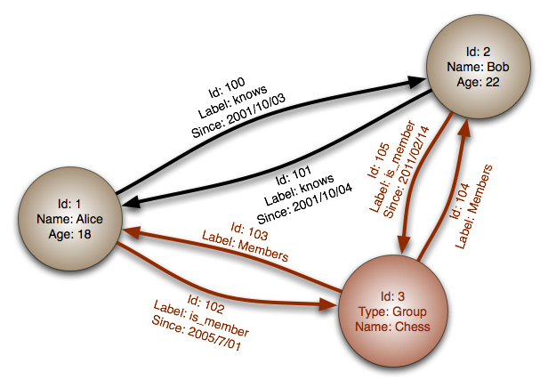

# Databases

----

# SQL

The first generation of data storage systems, data is stored as records on the disk. SQL is used to store data that should be persistent and is not updated frequently.

## PostgreSQL
PostgreSQL can be downloaded from the linux distribution's package manager. MacOS users can install it from brew as follows:

```sh
brew install postgresql
```

Additionally, the *services* package from brew is needed in order to integrate startup scripts with *Launchd*, MacOS default service manager:

```sh
brew tap homebrew/services
```

To list available services:

```sh
brew services list
```

To have a service startup at each login:

```sh
brew start <SERVICE>
```

To simply run the service, without auto-launching on each login:
```sh
brew run <SERVICE>
```

### Setting Up PostgreSQL
To setup PostgreSQL, make sure that the server is not running then login as postgres user as follows:
```sh
sudo -u postgres -i
```

initialize the data directory

```sh
initdb --locale $LANG -E UTF8 -D '/var/lib/postgres/data'
```

start the server, on Linux as a normal user, run:

```sh
sudo systemctl enable postgresql
sudo systemctl start postgresql
```

return to the `postgres` user and create a user for the server as follows:

```sh
createuser --interactive
```

### Configuring PostgreSQL

Caching can be setup in PostgreSQL to reduce disk access. Depending on the OS, the configuration file for PostgreSQL is found
> /var/lib/postgres/data/postgresql.conf

Typically to make most use of the cache it should be set to ***half*** the RAM size, the following option should be set accordingly inside the file:
> effective_cache_size = 4GB

Additionally it is possible to enable parallel search queries by setting the following depending on the cores available:
> max_parallel_workers = 8

More configuration parameters can be found [here](https://www.postgresql.org/docs/9.6/static/runtime-config.html).

### Configuring PostgreSQL In Code
To maintain system security, the login parameters for PostgreSQL that will be used in the Java code should be written in a configuration file and read by the code that deals with the database. This configuration file should the be added to the *gitignore* file so that it is not synchronized with the other developers.

**Example:**

> Config File

```sh
#host parameter can be left empty to default to localhost
#port parameter can be left empty to
username=
password=
host=
port=
database=
```
<br>
> Java reader

```java
public static void readConfFile() throws Exception {
    String file = System.getProperty("user.dir") + "/Postgres.conf";
    java.util.List<String> lines = new ArrayList<String>();
    Pattern pattern = Pattern.compile("\\[(.+)\\]");
    Matcher matcher;
    Stream<String> stream = Files.lines(Paths.get(file));
    lines = stream.filter(
      line -> !line.startsWith("#")).collect(Collectors.toList());

    for (int i = 0; i < lines.size(); i++) {
        if (lines.get(i).startsWith("user")) {
            matcher = pattern.matcher(lines.get(i));
            if (matcher.find())
                setDBUser(matcher.group(1));
            else
                throw new Exception("empty user in Postgres.conf");
        }
        if (lines.get(i).startsWith("database")) {
            matcher = pattern.matcher(lines.get(i));
            if (matcher.find())
                setDBName(matcher.group(1));
            else
                throw new Exception("empty database name in Postgres.conf");
        }
        if (lines.get(i).startsWith("pass")) {
            matcher = pattern.matcher(lines.get(i));
            matcher.find();
            setDBPassword(matcher.group(1));
        }
        if (lines.get(i).startsWith("host")) {
            matcher = pattern.matcher(lines.get(i));
            if (matcher.find())
                setDBHost(matcher.group(1));
            else
                setDBHost("localhost");
        }
        if (lines.get(i).startsWith("port")) {
            matcher = pattern.matcher(lines.get(i));
            if (matcher.find())
                setDBPort(matcher.group(1));
            else
                setDBPort("5432");
        }
    }
    if (!formatURL()) {
        throw new Exception("Wrong Format in Postgres.conf");

    }
}

private static boolean formatURL() {
    setDBURL("jdbc://postgresql://" + DB_HOST + ":" + "DB_PORT" + "/" + "DB_NAME");
    Pattern pattern = Pattern.compile("^\\w+:\\w+:\\/{2}\\w+:\\d+\\/\\w+(?:\\W|\\w)*$");
    Matcher matcher = pattern.matcher(DB_URL);
    return matcher.matches();
}
```

-----

# NoSQL
NoSQL databases are a new generation of databases designed for big data applications. Typically SQL databases' performance declines after a certain threshold of saved data on the disk, which is not the case in NoSQL databases.

There are multiple types of NoSQL databases each based on a specific usage, however NoSQL is overall generally used for large data sets.

### Column Based
These types of databases store data on the disk pages as columns rather than the traditional row layout of SQL databases. For instances given the following table:

| sensor_id | value | date     |
| :-------- | :---- | :------- |
| 1         | 2.0   | 2012-3-4 |
| 2         | 2.1   | 2012-5-4 |
| 3         | 5.0   | 2012-7-4 |
| 4         | 7.6   | 2012-8-4 |
| 5         | 8.1   | 2012-9-4 |


The column `value` will be stored sequentially on the disk rather than having sequential rows stored on the disk. Typically they are used for data-science based applications which require working on large arrays.

### Key-Value Based
These types of databases store data in a hashmap fashion and do not support complex data structures. Usually found in caches such as Redis as they provide the fastest access rates for data.

### Document Based
These type of databases store data as JSON/BSON objects and can support data nesting. Typically used in applications that require data to be structred to some degree and can be used to store images. If the database does not support Binary data, the images need to be encoded in Base64 format, that is changing the binary to strings.

```json
{
    "FirstName": "Bob",
    "Address": "5 Oak St.",
    "Hobby": "sailing"
}
```

### Graph Based
These type of databases store data as a graph, typically used for searching.



## ArangoDB
ArangoDB implements:
- Graph Based
- Document Based
- Key-Value Based

database types in one server. *The Key-Value implementation in ArangoDB is a document consisting of one entry only.* Arango implements its own querying language named AQL that supports CRUD (Create, Read, Update and Delete), more information can be found [here](https://docs.arangodb.com/3.3/AQL/DataQueries.html).


### Configuring ArangoDB
After installing ArangoDB, it may not startup due to issues with access permissions, to to solve such issue add your user to the arango group as follows:

```sh
sudo  -i
gpasswd -a <USER> arango
```

then ensure that arango's directories are owned by arango user and arango group:

```sh
chown arangodb:arangodb -R
chmod 770 -R

```

secure the installtion of arango, run the following as your normal user:

```sh
arango-secure-installation
```


start the server:

```sh
sudo systemctl enable arangodb3
sudo systemctl start arangodb3
```

The online interface is running at (http://localhost:8529)

### Graphs

A graph consists of two items:
- Vertices: this can either be a document of a ***Document Collection*** or of an ***Edge Collection***
- Edges: these are documents stored in ***Edge Collections***


As an analogy, in relational databases, tables may be created to map many-many relations, edge collections are similar to such tables, while vertices are similar to the actual records that the intermediary table connects. Graph based databases offer the ability to join multiple tables together without performing join operations, they simply follow the edges. Additionally attributes may be allocated to the edges and are typically directed graphs.

ArangoDB offers two forms of graphs:
- Named: this type ensures data integrity by imposing strict restrictions on the graph
- Anonymous: this type has more relaxed restrictions and fewer features albeit being faster than named graphs


### Document Based
Documents are a collection of objects, ArangoDB models documents into JSON objects. The Java driver accepts Java objects as maps them internally to JSON objects. Refer to the code for examples, more information can be found [here](https://github.com/arangodb/arangodb-java-driver).


## Cassandra
Cassandra is No-SQL column based database with a querying language with a syntax similar to SQL named CQL. Cassandra terminologies:
- Cluster: a collection of nodes or Data Centers arranged in a ring architecture. A name must be assigned to every cluster, which will subsequently be used by the participating nodes
- Keyspace: Similar to relational databases, the schema is the respective keyspace in Cassandra. The keyspace is the outermost container for data in Cassandra. The main attributes to set per keyspace are the Replication Factor, the Replica Placement Strategy and the Column Families
- Column Family: Column Families in Cassandra are like tables in Relational Databases. Each Column Family contains a col lection of rows which are represented by:
  ​                                                           *Map\<RowKey, SortedMap\<ColumnKey, ColumnValue\>\>*
   The key gives the ability to access related data together
- Column: A column in Cassandra is a data structure which contains a column name, a value and a timestamp. The columns and the number of columns in each row may vary in contrast with a relational database where data are well structured


***There is a known limitation with named sessions, that causes the driver to unexpectedly block the calling thread in certain circumstances; if using a fully asynchronous model, a session with no keyspace should be used. Additionally if a `USE` statement is issued, it will change the default keyspace on that session:***

```java
Session session = cluster.connect();
// No default keyspace set, need to prefix:
session.execute("select * from myKeyspace.myTable where id = 1");

session.execute("USE myKeyspace");
// Now the keyspace is set, unqualified query works:
session.execute("select * from myTable where id = 1");
```

### Replication Strategies

#### SimpleStrategy

Used only for a single datacenter and one rack. This strategy places the first replica on a node determined by the partitioner. Additional replicas are placed on the next nodes clockwise in the ring without considering topology (rack or datacenter location). Used for evaluation and single data center test and development environments only. While developing, the keyspace can be set to *SimpleStrategy*.

#### NetworkTopologyStrategy

This strategy specifies how many replicas to be placed in each datacenter. This strategy places replicas in the same data center by walking the ring clockwise until reaching the first node in another rack. NetworkTopologyStrategy attempts to place replicas on distinct racks because nodes in the same rack (or similar physical grouping) often fail at the same time due to power, cooling, or network issues. When deciding how many replicas to configure in each datacenter, the two primary considerations are:
1. Being able to satisfy reads locally, without incurring cross data-center latency
2. Failure scenarios

The two most common ways to configure multiple datacenter clusters are:
- Two replicas in each datacenter: This configuration tolerates the failure of a single node per replication group and still allows local reads at a consistency level of ONE.
- Three replicas in each datacenter: This configuration tolerates either the failure of one node per replication group at a strong consistency level of LOCAL_QUORUM or multiple node failures per datacenter using consistency level ONE.

Asymmetrical replication groupings are also possible. For example, three replicas can exist in one datacenter to serve real-time application requests and use a single replica elsewhere for running analytics.


#### Consistency Levels - Replication Factor
Consistency levels in Cassandra can be configured to manage availability versus data accuracy. Configure consistency for a session or per individual read or write operation.

##### Write Consistency Level

Levels are sorted from *strongest* to *weakest*


| Level        | Description                              | Usage                                    |
| :----------- | :--------------------------------------- | :--------------------------------------- |
| ALL          | A write must be written to the commit log and memtable on all replica nodes in the cluster for that partition | Provides the highest consistency and the lowest availability of any other level |
| EACH_QUORUM  | Strong consistency. A write must be written to the commit log and memtable on a quorum of replica nodes in each datacenter | Used in multiple datacenter clusters to strictly maintain consistency at the same level in each datacenter. For example, choose this level if you want a read to fail when a datacenter is down and the QUORUM cannot be reached on that datacenter |
| QUORUM       | A write must be written to the commit log and memtable on a quorum of replica nodes across all datacenters | Used in either single or multiple datacenter clusters to maintain strong consistency across the cluster. Used if some level of failure is tolerable |
| LOCAL_QUORUM | Strong consistency. A write must be written to the commit log and memtable on a quorum of replica nodes in the same datacenter as the coordinator. Avoids latency of inter-datacenter communication. | Used in multiple datacenter clusters with a rack-aware replica placement strategy, such as NetworkTopologyStrategy, and a properly configured [snitch](http://docs.datastax.com/en/archived/cassandra/2.0/cassandra/architecture/architectureSnitchesAbout_c.html). Used to maintain consistency locally (within the single datacenter). Can be used with SimpleStrategy |
| ONE          | A write must be written to the commit log and memtable of at least one replica node. | Satisfies the needs of most users because consistency requirements are not stringent. |
| TWO          | A write must be written to the commit log and memtable of at least two replica nodes. | Similar to ONE.                          |
| THREE        | A write must be written to the commit log and memtable of at least three replica nodes. | Similar to TWO.                          |
| LOCAL_ONE    | A write must be sent to, and successfully acknowledged by, at least one replica node in the local datacenter | In a multiple datacenter clusters, a consistency level of `ONE` is often desirable, but cross-DC traffic is not. `LOCAL_ONE`                accomplishes this. For security and quality reasons, this level is used in an offline datacenter to prevent automatic connection to online nodes in other datacenters if an offline node goes down |
| ANY          | A write must be written to at least one node. If all replica nodes for the given        partition key are down, the write can still succeed after a [hinted handoff](https://docs.datastax.com/en/cassandra/3.0/cassandra/operations/opsRepairNodesHintedHandoff.html) has been written. If all replica nodes are down at write time, an `ANY` write is not readable until the replica nodes for that partition have recovered | Provides low latency and a guarantee that a write never fails. Delivers the lowest        consistency and highest availability |


$$
\text{Quorum} = \frac{1}{2}\Sigma_{i}^{N} f_i + 1
$$

##### Read Consistency

Levels are sorted from strongest to weakest

| Level        | Description                              | Usage                                    |
| :----------- | :--------------------------------------- | :--------------------------------------- |
| ALL          | Returns the record after all replicas have responded. The read operation will fail if a replica does not respond | Provides the highest consistency of all levels and the lowest availability of all levels |
| EACH_QUORUM  | -                                        | Not supported for reads                  |
| QUORUM       | Returns the record after a quorum of replicas from all datacenters has responded | Used in either single or multiple datacenter clusters to maintain strong consistency across the cluster. Ensures strong consistency if you can tolerate some level of failure |
| LOCAL_QUORUM | Returns the record after a quorum of replicas in the current datacenter as the coordinator has reported. Avoids latency of inter-datacenter communication | Used in multiple datacenter clusters with a rack-aware replica placement strategy ( NetworkTopologyStrategy) and a properly configured snitch. Fails when using SimpleStrategy |
| ONE          | Returns a response from the closest replica, as determined by the snitch. By default, a read repair runs in the background to make the other replicas consistent | Provides the highest availability of all the levels if you can tolerate a comparatively high probability of stale data being read. The replicas contacted for reads may not always have the most recent write |
| TWO          | Returns the most recent data from two of the closest replicas | Similar to ONE                           |
| THREE        | Returns the most recent data from three of the closest replicas | Similar to TWO                           |
| LOCAL_ONE    | Returns a response from the closest replica in the local datacenter | Same usage as described in the table about write consistency levels |
| SERIAL       | Allows reading the current (and possibly uncommitted) state of data without proposing a new addition or update. If a SERIAL read finds an uncommitted transaction in progress, it will commit the transaction as part of the read. Similar to QUORUM | To read the latest value of a column after a user has invoked a lightweight transaction to write to the column, use SERIAL. Cassandra then checks the inflight lightweight transaction for updates and, if found, returns the latest data |
| LOCAL_SERIAL | Same as SERIAL, but confined to the datacenter. Similar to LOCAL_QUORUM | Used to achieve [linearizable](https://docs.datastax.com/en/cassandra/3.0/cassandra/dml/dmlAboutDataConsistency.html#dmlAboutDataConsistency__linearizable-consistency) consistency for lightweight transactions |
