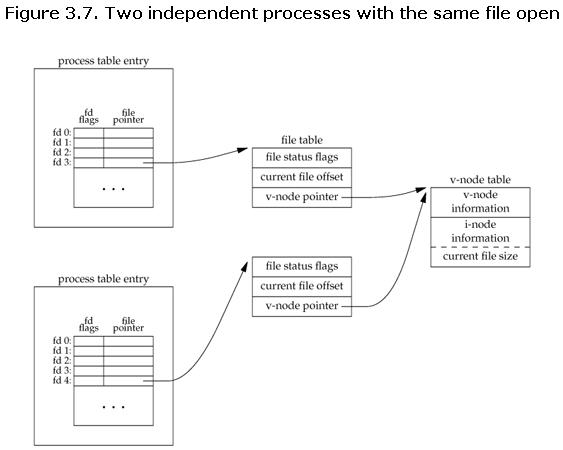
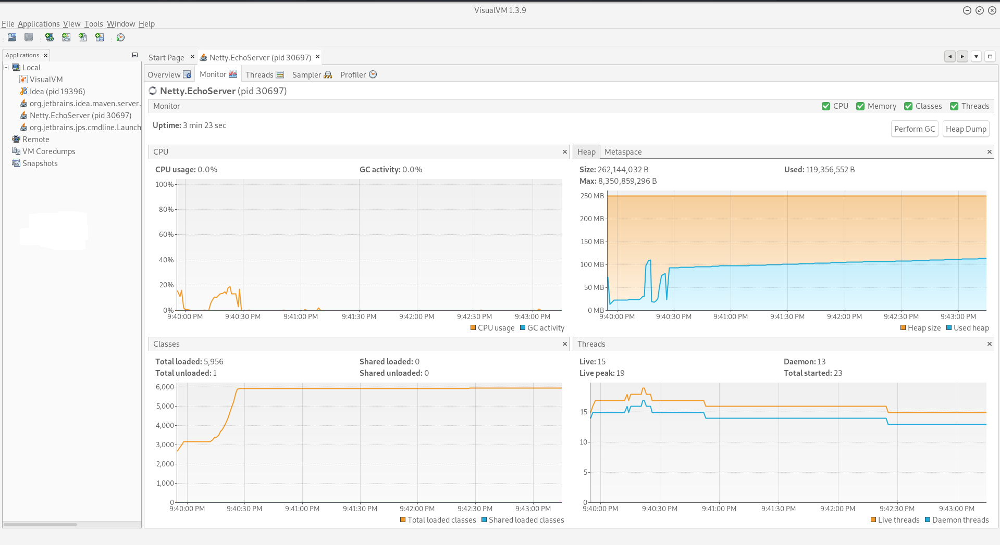
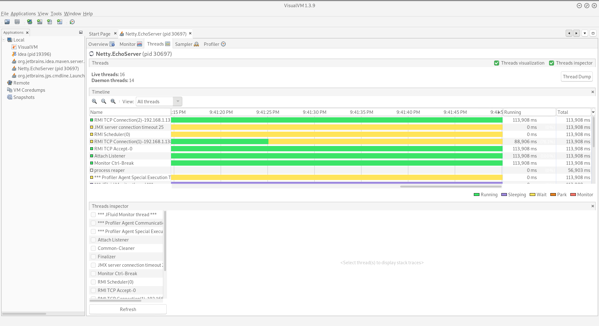
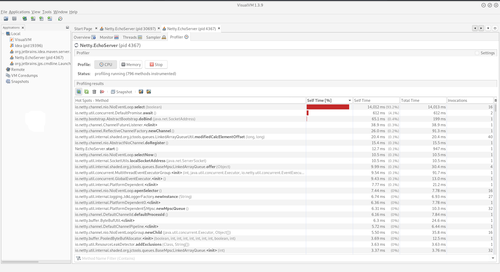

# Load Testing
------
After creating the application, it is necessary to benchmark the application to see the effective number of users it can serve concurrently. This can be done through the use of stress testing.

## Tsung

Tsung is a feature rich benchmarking tool written in Erlang (running on top of Beam VM), which can spawn millions of virtual users to test the application. It supports centralized and distributed testing environments. Utilizing the actor model in the Beam VM, it provides highly concurrent testing. The tests are defined as XML documents.

### Installing Tsung
Tsung is available in many Linux distribution repositories and can be downloaded depending on your package manager. For ArchLinux:

> `yaourt -S tsung --noconfirm`

For Mac users, it is availble on homebrew:

> `brew install tsung`

### File Descriptor
The kernel assigns a table to each running process, named *File Descriptor*, this table is responsible for keeping track of which files are open by the said process, by assigning a unique number to each file in the table. The table itself does not carry the file, but a pointer to the file in the kernel (in the filesystem). By default the kernel sets a default maximum for the number of entries per file descriptor tables, it may be overridden.



### Running Tsung

When running the tests, make sure that the number of users is not too large such that the table overflows and an exception occurs.

For a simple test:
```XML
<?xml version="1.0"?>
<!DOCTYPE tsung SYSTEM "/usr/share/tsung/tsung-1.0.dtd">
<!-- set dumptraffic="true" to dump all received and sent packets -->
<!-- set loglevel="debug" for maximum verbosity -->
<tsung loglevel="notice" dumptraffic="false" version="1.0">

    <!-- Client side setup -->
    <clients>
        <!-- maxusers is the max number of simultaneous clients. Don't set
        it too high because you can run out of file descriptors,
        ssl_esock use 2 fds by connection. -->

        <client host="localhost"  maxusers="500" use_controller_vm="true"/>

        <!-- Several virtual IP can be used to simulate more
        machines. Very useful when a load-balancer use the client's IP to
        distribute the traffic amoung a cluster of servers-->
        <!-- <ip value="192.168.2.223"></ip> -->
        <!-- <ip value="192.168.2.224"></ip> -->
        <!-- </client> -->

        <!-- a second machine is used, with a higher weight, and 2 cpus
        (erlang is not SMP aware, so we starts 2 beams to use all the
        CPUs -->
        <!-- <client host="myhost2" weight="3" maxusers="250" cpu="2">
        <ip value="192.168.2.225"></ip>
        </client> -->

        <!-- If you have a single machine to do the tests, you may add
        this attribute to the client tag: use_controller_vm="true" . This
        will run the virtual users on the same Virtual Machine as the
        controller. Useful if you have problems with starting up remote
        beam -->

    </clients>

    <!-- Server side setup -->
    <!-- Specify where the server is to test
    multiple servers can be defined for distributed testing -->
    <servers>
        <server host="localhost" port="3000" type="tcp"/>
    </servers>

    <!-- to start os monitoring (cpu, network, memory). Use an erlang
    agent on the remote machine or SNMP. Erlang is the default
    The web interface is running at port 8091 -->
    <monitoring>
        <monitor host="localhost" type="erlang"></monitor>
    </monitoring>

    <!-- several arrival phases can be set: for each phase, you can set
    the mean inter-arrival time between new clients and the phase
    duration -->
    <load>
        <arrivalphase phase="1" duration="1" unit="minute">
            <users arrivalrate="20" unit="second"></users>
        </arrivalphase>
        <arrivalphase phase="2" duration="1" unit="minute">
            <users arrivalrate="30" unit="second"></users>
        </arrivalphase>
    </load>

    <options>

        <!-- HTTP parameters -->
        <!-- If you want to benchmark a proxy server
        instead of a reguler web server-->
        <!--   <default type="ts_http" name="http_use_server_as_proxy" value="true"/> -->

        <!-- Specify the virtual agent's browser, and the probabilty of each
        new agent spawning each -->

        <option type="ts_http" name="user_agent">
            <user_agent probability="80">Mozilla/5.0 (X11; U; Linux i686; en-US; rv:1.7.8) Gecko/20050513 Galeon/1.3.21</user_agent>
            <user_agent probability="20">Mozilla/5.0 (Windows; U; Windows NT 5.2; fr-FR; rv:1.7.8) Gecko/20050511 Firefox/1.0.4</user_agent>
        </option>
    </options>

    <sessions>
        <session name="http-example" probability="100" type="ts_http">
            <request> <http url="/" method="GET" version="1.1"></http> </request>
        </session>
    </sessions>
</tsung>

```
#### SSH Ask-Pass

By default, Tsung uses SSH to connect to the servers to start the Beam VM, thus it requires an SSH askpass application, to request the password from the user.

##### Linux
Depending on your Linux distribution there are multiple ask-pass clients that can be installed, for **Gnome** interface for example, the application `Seahorse` comes with an ask-pass client. It is found in the repository of most linux distributions and can be installed normally.

In order for Tsung to use the ask pass client, the path to the ask-pass client must be exported in the shell as so:

> `export SSH_ASKPASS=/usr/lib/seahorse/ssh-askpass`

***Note this assumes, you are using Seahorse as the ask-pass client and requires that Tsung is started from the same shell, the variable was exported in. If another ask-pass client is to be used, export the correct path***

##### Mac
Mac users can use the askpass script supplied in the repository. After exporting the `SSH_ASKPASS` variable, another variable needs to be set as so:
> `export DISPLAY=":0"`


#### Starting The Test

To run the test:

> `tsung -f http_simple.xml start`

***Note: Mac users may need to copy the XML document type definition (DTD) into the same directory the XML file is in.***

A web interface is running at [localhost:8091](http://localhost:8091), alternatively you may use the `watch` command to monitor the progress of the tests as so:

> `watch -n1 tsung -f http_simple.xml status`

***Note: Mac users may need to install the `watch` command from brew.***

For more details regarding the XML file, consult the [official documentation](http://tsung.erlang-projects.org/user_manual/configuration.html). To send JSON requests in the tests, the quotations must be escaped, for instance:
$$
\text{\{"name" : "hamada"\}} \longrightarrow \text{\{&quot;name&quot; : &quot;hamada&quot;\}}
$$

## Artillery

Similar to Tsung, except that is built on NodeJS utilizing the asynchronous model of the V8 engine (NodeJS VM). Unlike Tsung, it uses YAML format for defining the tests and it is not as feature rich.

### Installing Artillery

To install artillery:

> `npm install -g artillery`

### Running Artillery

```yaml
config:
  target: "http://localhost:3000"
  phases:
    - duration: 60
      arrivalRate: 5
    - duration: 120
      arrivalRate: 5
      rampTo: 50
    - duration: 600
      arrivalRate: 50
  payload:
    path: "users.csv"
    fields:
      - "username"	# Will create a local variable username to be used below
      - "password" # Will create a local variable password to be used below
scenarios:
  - name: "Search and buy"
    flow: # Flow is an array of operations that a user may perform
      - post:
          url: "/auth"
          json: 
            username: "{{username}}"
            password: "{{password}}"            
      - get:
          url: "/details/{{ id }}"
      - think: 3
      - post:
          url: "/cart"
          json:
            productId: "{{ id }}"
```

Artillery allows for inserting data from a CSV file, for example: it is possible to have a precompiled list of usernames and passwords to be tested in a CSV file. To run the test:

> `artillery run http_simple.yml`


More commands and information can be found in the [official documentation](https://artillery.io/docs/getting-started/).

## VisualVM

VisualVM is a tool used to monitor the internal state of the JVM per application. The application may be started with the application that is to be monitored or, attached to a running application. IntelliJ offers a VisualVM plugin, that allows for monitoring an application while it starts.


### Monitoring An Application

Start your application normally from within the IDE while ensuring that the following JVM arguments are placed:

> `-Xverify:none`

Start VisualVM and the interface should look like this:



It is possible to monitor remote JVMs by connecting to the remote machine using its IP. Heading over to the `Threads` tab the interface should look like this:



| Thread State | Description                                                  |
| ------------ | ------------------------------------------------------------ |
| Running      | Thread is currently executing                                |
| Sleeping     | Thread is currently not in use                               |
| Waiting      | Thread is blocked by a mutex/barrier and requires another thread to relinquish the lock |
| Parked       | Thread is not permitted to execute by removing it from the scheduling process |
| Monitor      | Thread is blocked                                            |

### Profiling An Application

To get statistics regarding the CPU and memory time spent the application needs to be profiled while it is starting up. Before profiling it is important to calibrate the profiling tool which can be found in:
$$
\text{Tools} \rightarrow \text{Options} \rightarrow \text{Profiling} \rightarrow\text{Manage} 
$$
***Note: while calibrating, it is important to disable dynamic frequency scaling on the CPU to avoid incorrect results, several tools exist to disable this, on Linux for example, the `cpupower` tool can do this by locking the maximum and minimum clocks at the same value***.

To enable profiling while the application starts, the plugin needs to be installed from the plugin manager in the Tools menu. After running the plugin, an output similar to this should be available:



